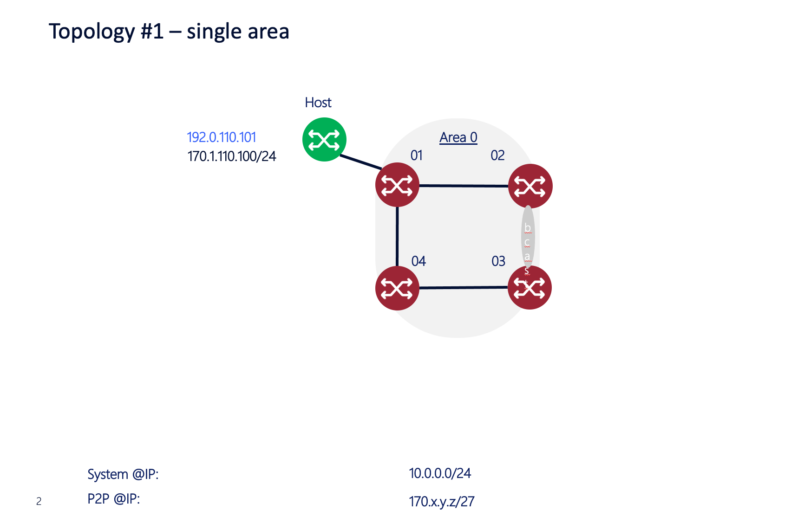
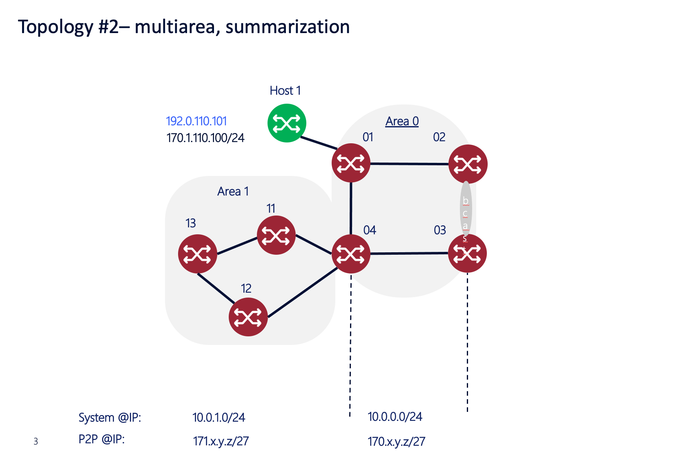
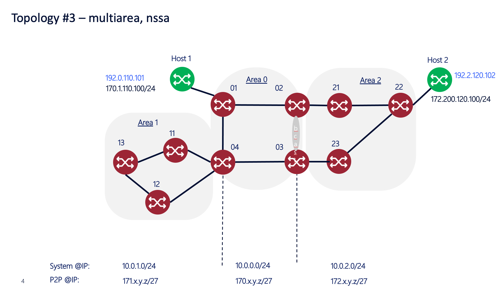
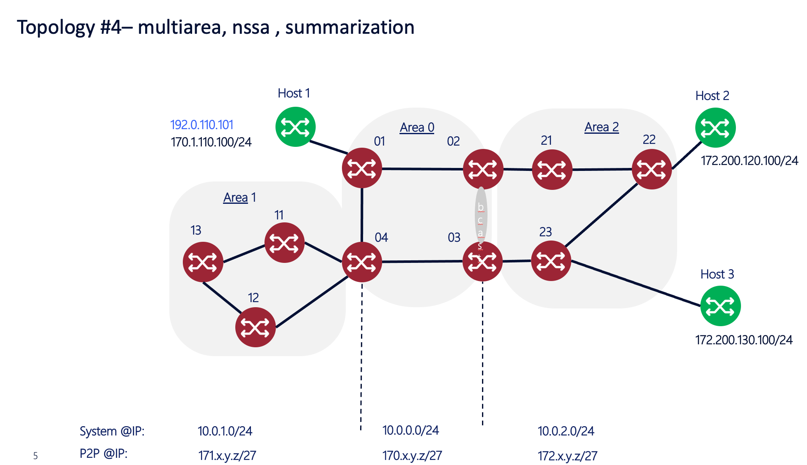
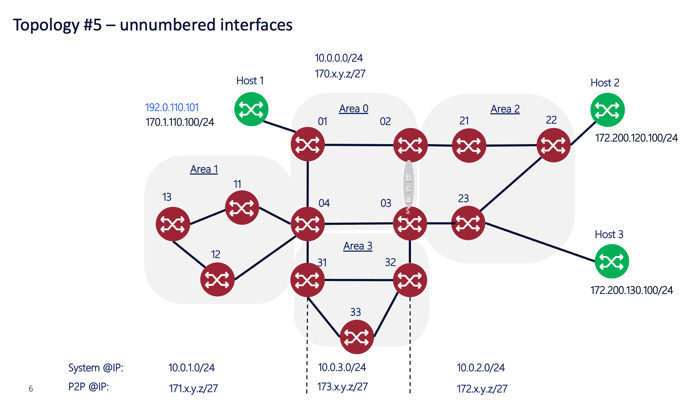

# DCN workshop clab

## Containerlab Setup

[Containerlab][clab] is distributed as a Linux deb/rpm package and can be installed on any Debian- or RHEL-like distributive.

The following requirements must be satisfied to let clab tool run successfully:

A user should have sudo privileges to run clab. A Linux server/VM and Docker installed.
Load container images (e.g. Nokia SR Linux, Arista cEOS) that are not downloadable from a container registry. 
Clab will try to pull images at runtime if they do not exist locally.

Detailed instructions with variants are available in the installation [guide][install]

### docker installation example (CentOS)

Uninstall old versions of docker:

```sh
sudo yum remove docker \
                  docker-client \
                  docker-client-latest \
                  docker-common \
                  docker-latest \
                  docker-latest-logrotate \
                  docker-logrotate \
                  docker-engine
```

Set up the repository:

```sh
sudo yum install -y yum-utils
sudo yum-config-manager  --add-repo   https://download.docker.com/linux/centos/docker-ce.repo
```

Install and start docker:

```sh
sudo yum install docker-ce docker-ce-cli containerd.io docker-buildx-plugin
sudo systemctl start docker
sudo docker run hello-world
```

Important! in order to avoid using `sudo` every time you run docker command, do not forget to add [your user into docker group](https://docs.docker.com/engine/install/linux-postinstall/)

### Proxy settings for docker

Create a systemd drop-in directory for the docker service: 

```sh
sudo mkdir -p /etc/systemd/system/docker.service.d
```

Create a dedicated systemd unit file:

```sh
sudo touch /etc/systemd/system/docker.service.d/http-proxy.conf
```

Put the corresponding proxy settings into the file:

```sh
[Service]
Environment="HTTP_PROXY=http://<PROXY>:8080"
Environment="HTTPS_PROXY=http://<PROXY>:8080"
Environment="NO_PROXY=localhost,127.0.0.1,instance-data,169.254.169.254,.nsn-net.net,.nsn-rdnet.net,.ext.net.nokia.c
om,.int.net.nokia.com,.inside.nsn.com,.inside.nokiasiemensnetworks.com"
```

Restart docker and verify setting applied:

```sh
sudo systemctl daemon-reload
sudo systemctl restart docker.service
sudo systemctl show --property=Environment docker
```

```sh
$ sudo systemctl show --property=Environment docker
Environment=HTTP_PROXY=http://<PROXY>:8080 HTTPS_PROXY=http://<PROXY>:8080 NO_PROXY=loca …
```

### clab installation example

The first way of doing that is via script:

```sh
sudo bash -c "$(curl -sL https://get.containerlab.dev)"
```

Alternatively is could be done from the official package repository:

```sh
$ sudo yum-config-manager --add-repo=https://yum.fury.io/netdevops/ && \
echo "gpgcheck=0" | sudo tee -a /etc/yum.repos.d/yum.fury.io_netdevops_.repo

$ sudo yum install containerlab
```

Installation status can be easily verified using `clab` command:

```sh
$ sudo clab version
                           _                   _       _
                 _        (_)                 | |     | |
 ____ ___  ____ | |_  ____ _ ____   ____  ____| | ____| | _
/ ___) _ \|  _ \|  _)/ _  | |  _ \ / _  )/ ___) |/ _  | || \
( (__| |_|| | | | |_( ( | | | | | ( (/ /| |   | ( ( | | |_) )
\____)___/|_| |_|\___)_||_|_|_| |_|\____)_|   |_|\_||_|____/

    version: 0.35.2
     commit: 2b749b48
       date: 2023-01-20T14:42:30Z
     source: https://github.com/srl-labs/containerlab
 rel. notes: https://containerlab.dev/rn/0.35/#0352
```

### Start your OSPF lab

Clone github repo:

```sh
git clone https://gitlabe2.ext.net.nokia.com/azyablov/optics-dcn-workshop-ospf-demo.git
cd optics-dcn-workshop-ospf-demo
```

Deploy clab topology:

```sh
$ sudo clab deploy
INFO[0000] Containerlab v0.40.0 started                 
INFO[0000] Parsing & checking topology file: dcn_demo.clab.yml 
INFO[0000] Creating lab directory: /home/azyablov/clab/optics-dcn-workshop-ospf-demo/clab-dcn_demo 
INFO[0000] Creating docker network: Name="dcn_demo", IPv4Subnet="192.168.22.0/24", IPv6Subnet="", MTU="1500" 
INFO[0000] Creating container: "router33"               
INFO[0000] Creating container: "router01"               
INFO[0000] Creating container: "router22"               
INFO[0000] Creating container: "router13"               
INFO[0000] Creating container: "host03"                 
INFO[0000] Creating container: "router02"               
INFO[0000] Creating container: "host01"                 
INFO[0000] Creating container: "router04"               
INFO[0000] Creating container: "router11"               
INFO[0001] Creating container: "router21"               
INFO[0001] Creating container: "router31"               
INFO[0001] Creating container: "router12"               
INFO[0001] Creating container: "host02"                 
INFO[0001] Creating container: "router32"               
INFO[0001] Creating container: "router03"               
INFO[0001] Creating container: "router23"               
INFO[0001] Creating virtual wire: router01:eth0102 <--> router02:eth0102 
INFO[0001] Creating virtual wire: router01:eth0104 <--> router04:eth0104 
INFO[0001] Creating virtual wire: router01:eth110 <--> host01:eth110 
INFO[0002] Creating virtual wire: router02:eth0221 <--> router21:eth0221 
INFO[0002] Creating virtual wire: router04:eth0412 <--> router12:eth0412 
INFO[0002] Creating virtual wire: router22:eth120 <--> host02:eth120 
INFO[0002] Creating virtual wire: router21:eth2122 <--> router22:eth2122 
INFO[0002] Creating virtual wire: router04:eth0411 <--> router11:eth0411 
INFO[0002] Creating virtual wire: router11:eth1113 <--> router13:eth1113 
INFO[0002] Creating virtual wire: router04:eth0431 <--> router31:eth0431 
INFO[0002] Creating virtual wire: router12:eth1213 <--> router13:eth1213 
INFO[0002] Creating virtual wire: router31:eth3133 <--> router33:eth3133 
INFO[0003] Creating virtual wire: router03:eth0323 <--> router23:eth0323 
INFO[0003] Creating virtual wire: router32:eth3233 <--> router33:eth3233 
INFO[0003] Creating virtual wire: router31:eth3132 <--> router32:eth3132 
INFO[0003] Creating virtual wire: router22:eth2223 <--> router23:eth2223 
INFO[0003] Creating virtual wire: router23:eth130 <--> host03:eth130 
INFO[0003] Creating virtual wire: router03:eth0304 <--> router04:eth0304 
INFO[0003] Creating virtual wire: router02:eth0203 <--> router03:eth0203 
INFO[0003] Creating virtual wire: router03:eth0332 <--> router32:eth0332 
INFO[0003] Adding containerlab host entries to /etc/hosts file 
INFO[0005] Executed command "ip route delete 0.0.0.0/0 via 192.168.22.254" on the node "router13". stdout: 
INFO[0005] Executed command "ip addr del 127.0.0.1/8 dev lo" on the node "router13". stdout: 
INFO[0005] Executed command "ip route delete 0.0.0.0/0 via 192.168.22.254" on the node "router32". stdout: 
INFO[0005] Executed command "ifconfig eth110 170.1.110.100 netmask 255.255.255.0" on the node "host01". stdout: 
INFO[0005] Executed command "route add -net 0.0.0.0 netmask 0.0.0.0 gw 170.1.110.1" on the node "host01". stdout: 
INFO[0005] Executed command "route del -net 0.0.0.0 netmask 0.0.0.0 gw 192.168.22.254" on the node "host01". stdout: 
INFO[0005] Executed command "ip addr add 192.0.110.101/32 dev lo" on the node "host01". stdout: 
INFO[0005] Executed command "ip addr del 127.0.0.1/8 dev lo" on the node "host01". stdout: 
INFO[0005] Executed command "ip route delete 0.0.0.0/0 via 192.168.22.254" on the node "router22". stdout: 
INFO[0005] Executed command "ip addr del 127.0.0.1/8 dev lo" on the node "router22". stdout: 
INFO[0005] Executed command "ifconfig eth120 172.200.120.100 netmask 255.255.255.0" on the node "host02". stdout: 
INFO[0005] Executed command "route add -net 0.0.0.0 netmask 0.0.0.0 gw 172.200.120.22" on the node "host02". stdout: 
INFO[0005] Executed command "route del -net 0.0.0.0 netmask 0.0.0.0 gw 192.168.22.254" on the node "host02". stdout: 
INFO[0005] Executed command "ip addr add 192.2.120.102/32 dev lo" on the node "host02". stdout: 
INFO[0005] Executed command "ip addr del 127.0.0.1/8 dev lo" on the node "host02". stdout: 
INFO[0005] Executed command "ip route delete 0.0.0.0/0 via 192.168.22.254" on the node "router04". stdout: 
INFO[0005] Executed command "ip addr del 127.0.0.1/8 dev lo" on the node "router04". stdout: 
INFO[0005] Executed command "ip route delete 0.0.0.0/0 via 192.168.22.254" on the node "router21". stdout: 
INFO[0005] Executed command "ip addr del 127.0.0.1/8 dev lo" on the node "router21". stdout: 
INFO[0005] Executed command "ip route delete 0.0.0.0/0 via 192.168.22.254" on the node "router12". stdout: 
INFO[0005] Executed command "ip addr del 127.0.0.1/8 dev lo" on the node "router12". stdout: 
INFO[0005] Executed command "ip route delete 0.0.0.0/0 via 192.168.22.254" on the node "router23". stdout: 
INFO[0005] Executed command "ip addr del 127.0.0.1/8 dev lo" on the node "router23". stdout: 
INFO[0005] Executed command "ip route delete 0.0.0.0/0 via 192.168.22.254" on the node "router03". stdout: 
INFO[0005] Executed command "ip addr del 127.0.0.1/8 dev lo" on the node "router03". stdout: 
INFO[0005] Executed command "ifconfig eth130 172.200.130.100 netmask 255.255.255.0" on the node "host03". stdout: 
INFO[0005] Executed command "route add -net 0.0.0.0 netmask 0.0.0.0 gw 172.200.130.23" on the node "host03". stdout: 
INFO[0005] Executed command "route del -net 0.0.0.0 netmask 0.0.0.0 gw 192.168.22.254" on the node "host03". stdout: 
INFO[0005] Executed command "ip addr add 192.2.120.103/32 dev lo" on the node "host03". stdout: 
INFO[0005] Executed command "ip addr del 127.0.0.1/8 dev lo" on the node "host03". stdout: 
INFO[0005] Executed command "ip route delete 0.0.0.0/0 via 192.168.22.254" on the node "router11". stdout: 
INFO[0005] Executed command "ip addr del 127.0.0.1/8 dev lo" on the node "router11". stdout: 
INFO[0005] Executed command "ip route delete 0.0.0.0/0 via 192.168.22.254" on the node "router02". stdout: 
INFO[0005] Executed command "ip addr del 127.0.0.1/8 dev lo" on the node "router02". stdout: 
INFO[0005] Executed command "ip route delete 0.0.0.0/0 via 192.168.22.254" on the node "router33". stdout: 
INFO[0005] Executed command "ip route delete 0.0.0.0/0 via 192.168.22.254" on the node "router01". stdout: 
INFO[0005] Executed command "ip addr del 127.0.0.1/8 dev lo" on the node "router01". stdout: 
INFO[0005] Executed command "ip route delete 0.0.0.0/0 via 192.168.22.254" on the node "router31". stdout: 
+----+------------------------+--------------+---------------+-------+---------+-------------------+--------------+
| #  |          Name          | Container ID |     Image     | Kind  |  State  |   IPv4 Address    | IPv6 Address |
+----+------------------------+--------------+---------------+-------+---------+-------------------+--------------+
|  1 | clab-dcn_demo-host01   | a4ee753a7ada | alpine        | linux | running | 192.168.22.110/24 | N/A          |
|  2 | clab-dcn_demo-host02   | 6d9dad6b0858 | alpine        | linux | running | 192.168.22.122/24 | N/A          |
|  3 | clab-dcn_demo-host03   | a6c932b70e33 | alpine        | linux | running | 192.168.22.123/24 | N/A          |
|  4 | clab-dcn_demo-router01 | 40b2dad6a41a | arbiza/quagga | linux | running | 192.168.22.1/24   | N/A          |
|  5 | clab-dcn_demo-router02 | 7038849a5404 | arbiza/quagga | linux | running | 192.168.22.2/24   | N/A          |
|  6 | clab-dcn_demo-router03 | 42150cabd5ce | arbiza/quagga | linux | running | 192.168.22.3/24   | N/A          |
|  7 | clab-dcn_demo-router04 | 17f242279ee2 | arbiza/quagga | linux | running | 192.168.22.4/24   | N/A          |
|  8 | clab-dcn_demo-router11 | c7f25db83d70 | arbiza/quagga | linux | running | 192.168.22.11/24  | N/A          |
|  9 | clab-dcn_demo-router12 | ba562fcac63f | arbiza/quagga | linux | running | 192.168.22.12/24  | N/A          |
| 10 | clab-dcn_demo-router13 | a178050078e4 | arbiza/quagga | linux | running | 192.168.22.13/24  | N/A          |
| 11 | clab-dcn_demo-router21 | 0fde4a4469d7 | arbiza/quagga | linux | running | 192.168.22.21/24  | N/A          |
| 12 | clab-dcn_demo-router22 | 88c31892cb01 | arbiza/quagga | linux | running | 192.168.22.22/24  | N/A          |
| 13 | clab-dcn_demo-router23 | 6345217ffe8b | arbiza/quagga | linux | running | 192.168.22.23/24  | N/A          |
| 14 | clab-dcn_demo-router31 | ff33d03a1351 | frrouting/frr | linux | running | 192.168.22.31/24  | N/A          |
| 15 | clab-dcn_demo-router32 | cd33120fc78d | frrouting/frr | linux | running | 192.168.22.32/24  | N/A          |
| 16 | clab-dcn_demo-router33 | d6294329a0bf | frrouting/frr | linux | running | 192.168.22.33/24  | N/A          |
+----+------------------------+--------------+---------------+-------+---------+-------------------+--------------+
```

In order to check lab deployment status use `clab inspect`:

```sh
$ sudo clab inspect
INFO[0000] Parsing & checking topology file: dcn_demo.clab.yml 
+----+------------------------+--------------+---------------+-------+---------+-------------------+--------------+
| #  |          Name          | Container ID |     Image     | Kind  |  State  |   IPv4 Address    | IPv6 Address |
+----+------------------------+--------------+---------------+-------+---------+-------------------+--------------+
|  1 | clab-dcn_demo-host01   | a4ee753a7ada | alpine        | linux | running | 192.168.22.110/24 | N/A          |
|  2 | clab-dcn_demo-host02   | 6d9dad6b0858 | alpine        | linux | running | 192.168.22.122/24 | N/A          |
|  3 | clab-dcn_demo-host03   | a6c932b70e33 | alpine        | linux | running | 192.168.22.123/24 | N/A          |
|  4 | clab-dcn_demo-router01 | 40b2dad6a41a | arbiza/quagga | linux | running | 192.168.22.1/24   | N/A          |
|  5 | clab-dcn_demo-router02 | 7038849a5404 | arbiza/quagga | linux | running | 192.168.22.2/24   | N/A          |
|  6 | clab-dcn_demo-router03 | 42150cabd5ce | arbiza/quagga | linux | running | 192.168.22.3/24   | N/A          |
|  7 | clab-dcn_demo-router04 | 17f242279ee2 | arbiza/quagga | linux | running | 192.168.22.4/24   | N/A          |
|  8 | clab-dcn_demo-router11 | c7f25db83d70 | arbiza/quagga | linux | running | 192.168.22.11/24  | N/A          |
|  9 | clab-dcn_demo-router12 | ba562fcac63f | arbiza/quagga | linux | running | 192.168.22.12/24  | N/A          |
| 10 | clab-dcn_demo-router13 | a178050078e4 | arbiza/quagga | linux | running | 192.168.22.13/24  | N/A          |
| 11 | clab-dcn_demo-router21 | 0fde4a4469d7 | arbiza/quagga | linux | running | 192.168.22.21/24  | N/A          |
| 12 | clab-dcn_demo-router22 | 88c31892cb01 | arbiza/quagga | linux | running | 192.168.22.22/24  | N/A          |
| 13 | clab-dcn_demo-router23 | 6345217ffe8b | arbiza/quagga | linux | running | 192.168.22.23/24  | N/A          |
| 14 | clab-dcn_demo-router31 | ff33d03a1351 | frrouting/frr | linux | running | 192.168.22.31/24  | N/A          |
| 15 | clab-dcn_demo-router32 | cd33120fc78d | frrouting/frr | linux | running | 192.168.22.32/24  | N/A          |
| 16 | clab-dcn_demo-router33 | d6294329a0bf | frrouting/frr | linux | running | 192.168.22.33/24  | N/A          |
+----+------------------------+--------------+---------------+-------+---------+-------------------+--------------+
```

If you would like to save your config to continue next time where you leave the setup execute provided script `save_configs.sh`:

```sh
$ sudo ./save_configs.sh 
Building Configuration...
Configuration saved to /etc/quagga/zebra.conf
Configuration saved to /etc/quagga/ospfd.conf
Configuration saved to /etc/quagga/bgpd.conf
[OK]
Building Configuration...
Configuration saved to /etc/quagga/zebra.conf
Configuration saved to /etc/quagga/ospfd.conf
Configuration saved to /etc/quagga/bgpd.conf
[OK]
Building Configuration...
Configuration saved to /etc/quagga/zebra.conf
Configuration saved to /etc/quagga/ospfd.conf
Configuration saved to /etc/quagga/bgpd.conf
[OK]
Building Configuration...
Configuration saved to /etc/quagga/zebra.conf
Configuration saved to /etc/quagga/ospfd.conf
Configuration saved to /etc/quagga/bgpd.conf
[OK]
Building Configuration...
Configuration saved to /etc/quagga/zebra.conf
Configuration saved to /etc/quagga/ospfd.conf
Configuration saved to /etc/quagga/bgpd.conf
[OK]
Building Configuration...
Configuration saved to /etc/quagga/zebra.conf
Configuration saved to /etc/quagga/ospfd.conf
Configuration saved to /etc/quagga/bgpd.conf
[OK]
Building Configuration...
Configuration saved to /etc/quagga/zebra.conf
Configuration saved to /etc/quagga/ospfd.conf
Configuration saved to /etc/quagga/bgpd.conf
[OK]
Building Configuration...
Configuration saved to /etc/quagga/zebra.conf
Configuration saved to /etc/quagga/ospfd.conf
Configuration saved to /etc/quagga/bgpd.conf
[OK]
Building Configuration...
Configuration saved to /etc/quagga/zebra.conf
Configuration saved to /etc/quagga/ospfd.conf
Configuration saved to /etc/quagga/bgpd.conf
[OK]
Building Configuration...
Configuration saved to /etc/quagga/zebra.conf
Configuration saved to /etc/quagga/ospfd.conf
Configuration saved to /etc/quagga/bgpd.conf
[OK]
Note: this version of vtysh never writes vtysh.conf
Building Configuration...
Integrated configuration saved to /etc/frr/frr.conf
[OK]
Note: this version of vtysh never writes vtysh.conf
Building Configuration...
Integrated configuration saved to /etc/frr/frr.conf
[OK]
Note: this version of vtysh never writes vtysh.conf
Building Configuration...
Integrated configuration saved to /etc/frr/frr.conf
[OK]
```

In order to destroy your lab and release resources use `clab destroy`:

```sh
$ sudo clab destroy
INFO[0000] Parsing & checking topology file: dcn_demo.clab.yml 
INFO[0000] Destroying lab: dcn_demo                     
INFO[0000] Removed container: clab-dcn_demo-host02      
INFO[0000] Removed container: clab-dcn_demo-router01    
INFO[0000] Removed container: clab-dcn_demo-router02    
INFO[0000] Removed container: clab-dcn_demo-router32    
INFO[0000] Removed container: clab-dcn_demo-router22    
INFO[0000] Removed container: clab-dcn_demo-router33    
INFO[0000] Removed container: clab-dcn_demo-router23    
INFO[0000] Removed container: clab-dcn_demo-router13    
INFO[0000] Removed container: clab-dcn_demo-router12    
INFO[0000] Removed container: clab-dcn_demo-host01      
INFO[0000] Removed container: clab-dcn_demo-router11    
INFO[0000] Removed container: clab-dcn_demo-router04    
INFO[0000] Removed container: clab-dcn_demo-router21    
INFO[0000] Removed container: clab-dcn_demo-host03      
INFO[0000] Removed container: clab-dcn_demo-router03    
INFO[0000] Removed container: clab-dcn_demo-router31    
INFO[0000] Removing containerlab host entries from /etc/hosts file 
```

## Topology operations 

Connecting to containerized nodes based on quagga image (router01 to router23) use the following commands:

```sh
$ docker exec -it clab-dcn_demo-router01 /vtysh/vtysh

Hello, this is Quagga (version 1.2.4).
Copyright 1996-2005 Kunihiro Ishiguro, et al.

router01# 
```

and routers based on frr image (router31 to router33):

```sh
$ sudo docker exec -it clab-dcn_demo-router31 vtysh

Hello, this is FRRouting (version 8.4_git).
Copyright 1996-2005 Kunihiro Ishiguro, et al.

router31#
```

Connection to client hosts based on alpine image is very straightforward as well:

```sh
$ sudo docker exec -it clab-dcn_demo-host01 /bin/sh
 # hostname
host01
 #
```

## Playing with configuration and scenarios

Initially routers are configured with all necessary settings to establish OSPF adjacencies, 
but certain interfaces are disabled (shutdown) to start with the simple topology – single area and foster bigger topology and touching more complex cases.
By adding specific settings and enabling given interfaces users can go through topology scenarios demonstrated during a demo session. 
Basically, we are building more complex network topology and investigating different OSPF use cases (route redistribution, area summarization etc.).
In order to apply configuration you should be switching into configuration mode using `config t`.

### Topology#1

This topology exploring simplest case with one area, you can use [router01](topology_operations/topo%231_router01.txt) delta configuration in order to implement static route redistribution case.

Note! As you can see filename pointing out on the router where delte configuration should be applied.




### Topology#2

The second one case is multi-area implementation example and [configuration](topology_operations/topo%232_router04.txt) which should applied on router02.



### Topology#3

Here is a bit more complex case with OSPF NSSA, where configurations should be applied on [router02](topology_operations/topo%233_router02.txt) and [router03](topology_operations/topo%233_router03.txt).



### Topology#4

This topology repesents multi-area NSSA summarization case using area 2. To implement it delta configurations should be applied on [router02](topology_operations/topo%234_router02.txt), [router03](topology_operations/topo%234_router03.txt) and [router23](topology_operations/topo%234_router23.txt).



### Topology#5

The last case demonstrates unnumbered interfaces use in OSPF area 3.
As in previous cases you should apply configurations on [router03](topology_operations/topo%235_router03.txt) and [router04](topology_operations/topo%235_router04.txt)




[clab]: https://containerlab.dev
[install]:  https://containerlab.dev/install/

